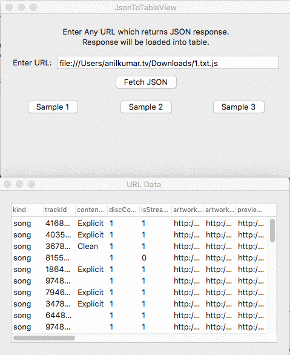

# JsonToDynamicTable
Loads JSON response from URL to dynamically created tableview.
It also supports local  URL.

# Clock Hand Usage #

checkout this screencast on [how to Use](http://recordit.co/MilCQqwmaL)
